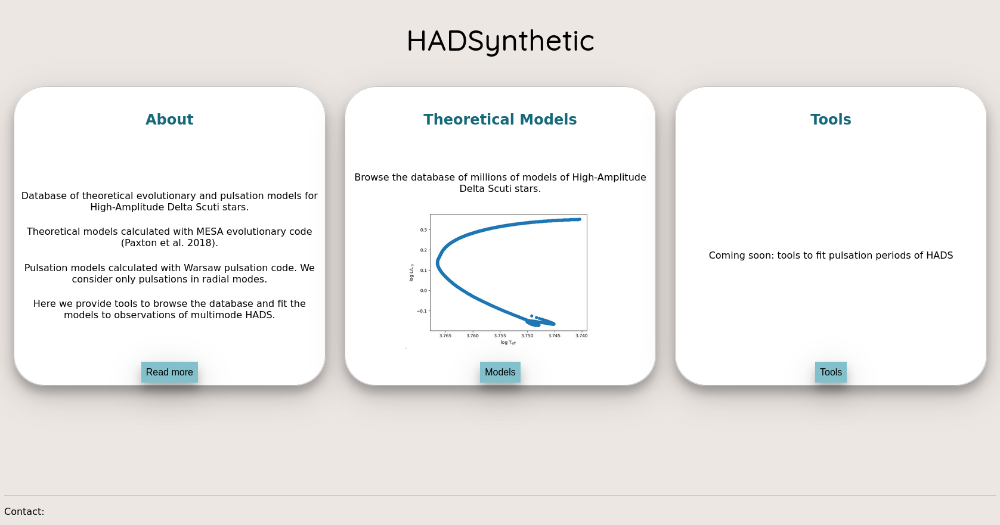
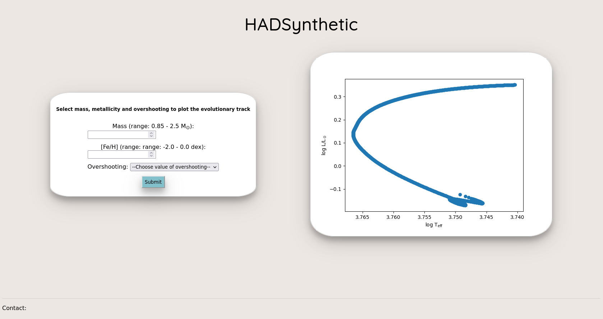

# HADSynthetic
Tool to browse the database of theoretical models of High-Amplitude Delta Scuti stars (HADS). 





## Models
Theoretical models are calculated with the MESA evolutionary code and Warsaw pulsation code as described in detail by Netzel & Smolec (2022).

We provide the tool to browse through the database. The User needs to select mass, metallicity [Fe/H], and overshooting to see the evolutionary track of a star with given parameters.



## Tools

HADSynthetic will provide the tools for interactive asteroseismic modeling of multi-mode radially pulsating HADS and SX Phoenicis stars. 

## Citing this work

If you find our grid of models usefull for your work, please cite 
```
Netzel & Smolec, 2022, MNRAS, 515, 4574
```
and acknowledge our browsing tool in the Acknowledgements.

